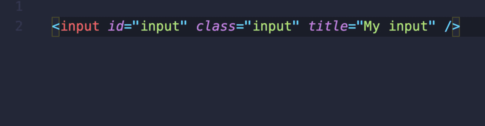
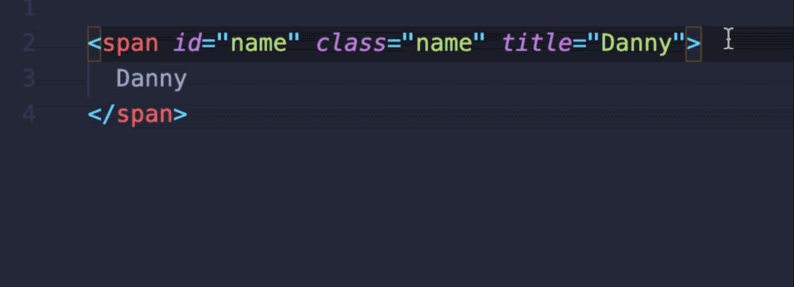
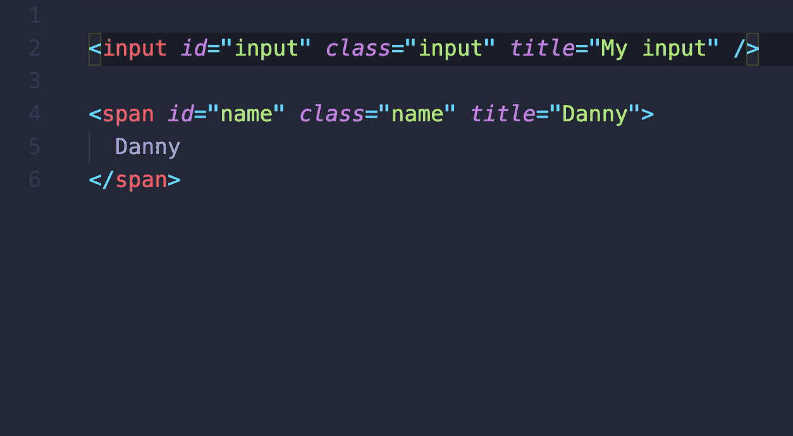

# **Split HTML Attributes** (VSCode Extension)

Tired of manually splitting your HTML attributes up onto multiple lines? 

You can now do it **instantly** with this extension:



## Features

### Opening tags

The extension works on opening tags:



### Self-closing tags

As well as self-closing tags:


### Multiple selections

And even works with multiple selections:



## Usage

Just select your opening (or self-closing) tag - from the opening angle bracket (`<`) up to the closing angle bracket (`>`) and either:
* Open Command Pallette (`CMD/CTRL + Shift + P`) and choose `Split HTML Attributes`
* Or use the keyboard shortcut (which defaults to `Ctrl + Alt + Shift + A`)

## Extension Settings

### `splitHTMLAttributes.tabSize`

Set the indentation size for your split lines.

* **Default:** 2
* **Must be:** Number

### `splitHTMLAttributes.useSpacesForTabs`

Use spaces for indentation (instead of tabs)

* **Default:** true
* **Must be:** Boolean

### Keybindings

You can change the keyboard shorcut. This is the default:

```json
{
  "command": "extension.splitHTMLAttributes",
  "key": "ctrl+alt+shift+a"
}
```

## Known Issues

No known issues yet.

## Release Notes

### 1.0.0

Initial release of **Split HTML Attributes**
